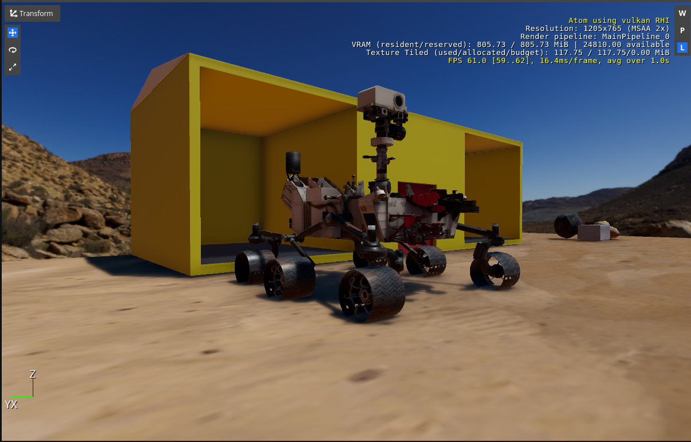
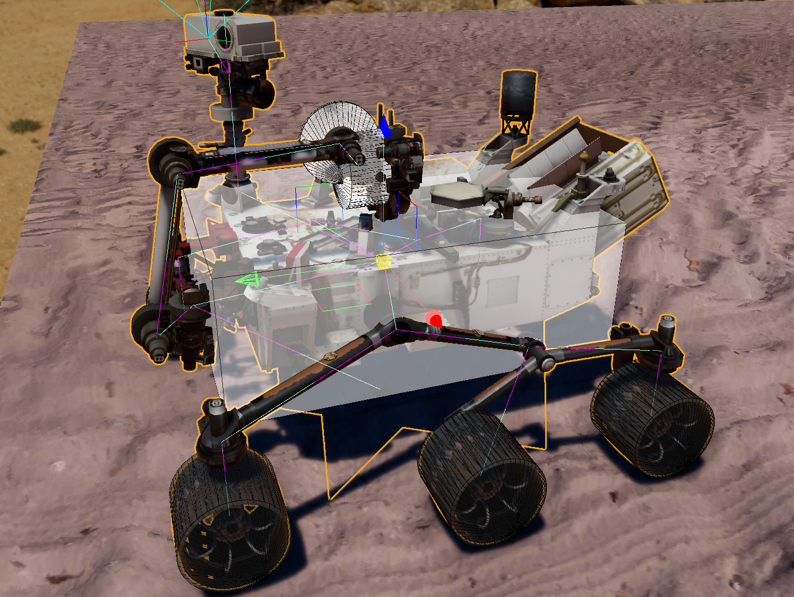

[![Apache License, Version 2.0][apache_shield]][apache]

# Curiosity Rover comes to Open 3D Engine.

Author: Azmyin Md. Kamal
Date: 09/09/2024
Version 1.0

This repository contains a ROS 2 enabled O3DE project to simulate a [Curiosity Rover](https://en.wikipedia.org/wiki/Curiosity_(rover)) traversing on a 3D terrian inspired by NASA JPL's [MarsYard](https://robotics.jpl.nasa.gov/how-we-do-it/facilities/marsyard-iii/) testing fascility. 
It was part of submission of NASA Space ROS Summer Sim Spring Challenge 2024 [#181](https://github.com/space-ros/docker/issues/181)

https://github.com/user-attachments/assets/865068a1-ec8b-4fd2-992a-1c8a992dbc21

In my opinion O3DE based robot simulation has the following advantages and disadvantages

* Pros
  * High fidelity rendering
  * Accurate physics interactions
  * Direct communication with ROS 2 middleware (unlike Gazebo that requires a briding package to bridge communication between it and ROS 2 middleware.)
  * Python and Lua supported scripting for complex **event** programming
  * A dedicated Terrain tool.
  * Feature rich UI, rapdily traversable entity tree 

* Cons
  * 60+ GB diskspace requriements
  * Documentations is **fuzzy** at best
  * Pipeline for importing assets from Asset Generation Tools (Blender) is **convoluted**

## Screenshots





## Dependencies

* Hardware: About **70 - 80** GB free diskspace, NVIDIA GPU and 16Gb Ram
* ROS 2 Gem: https://github.com/o3de/o3de-extras/tree/development/Gems/ROS2
* Open 3D Engine version >=23.04
* MarsYard Gem: https://github.com/Mechazo11/MarsYardGem
* NasaCuriosityRover Gem: https://github.com/Mechazo11/NasaCuriosityRoverGem

## Installation

* Build and run the Docker image in [o3de_nasa_rover](https://github.com/Mechazo11/o3de_nasa_rover) repository. 

## Status

This project is **no longer maintained**. I have included some of my notes in the ```NOTES``` directory as additional materials. The ```SOME_IDEAS.md``` file contains some of the TODOs I was planning on doing if I were maintaining this project any further.

If you have any questions, concerns or comments don't hestiate to reaching out to me. My contact information is available in my homepage: https://mechazo11.github.io/.

## Acknowledgments

This work is licensed under [Apache License, Version 2.0][apache]. You may elect at your option to use the [MIT License][mit] instead. Contributions must be made under both licenses.

[apache]: https://opensource.org/licenses/Apache-2.0
[mit]: https://opensource.org/licenses/MIT
[apache_shield]: https://img.shields.io/badge/License-Apache_2.0-blue.svg
